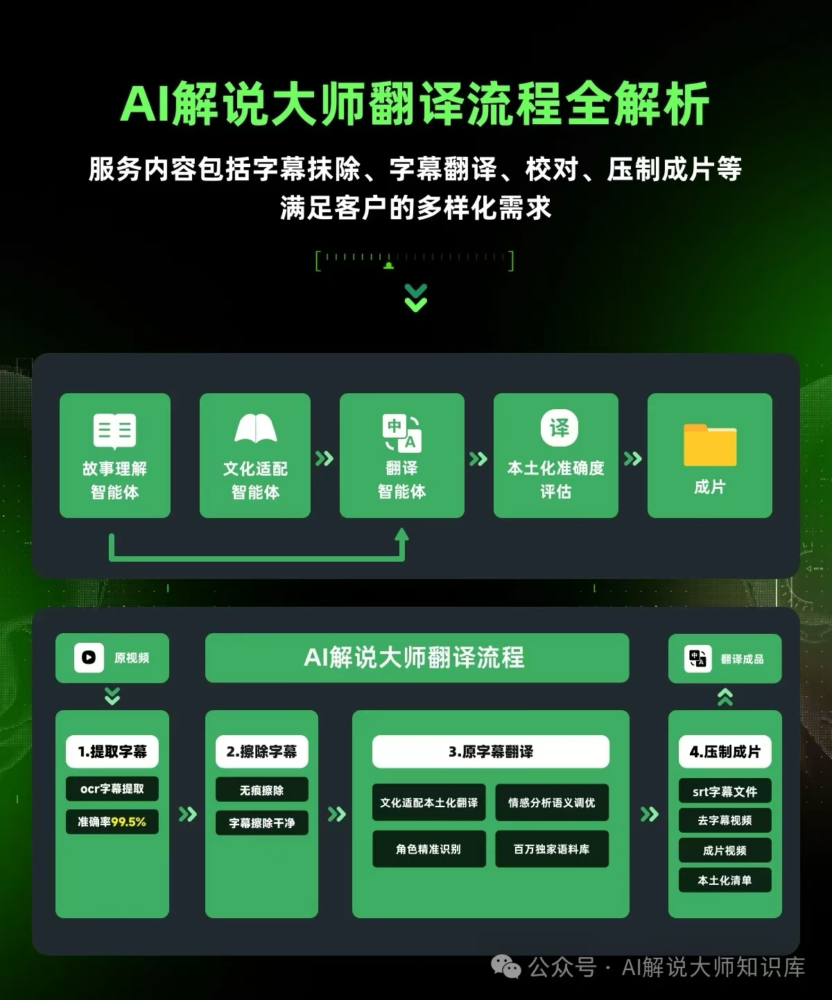
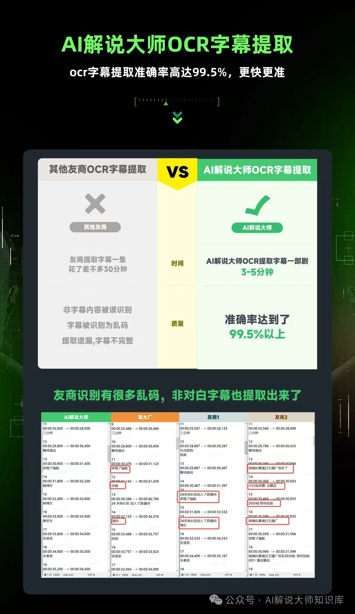
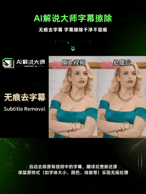
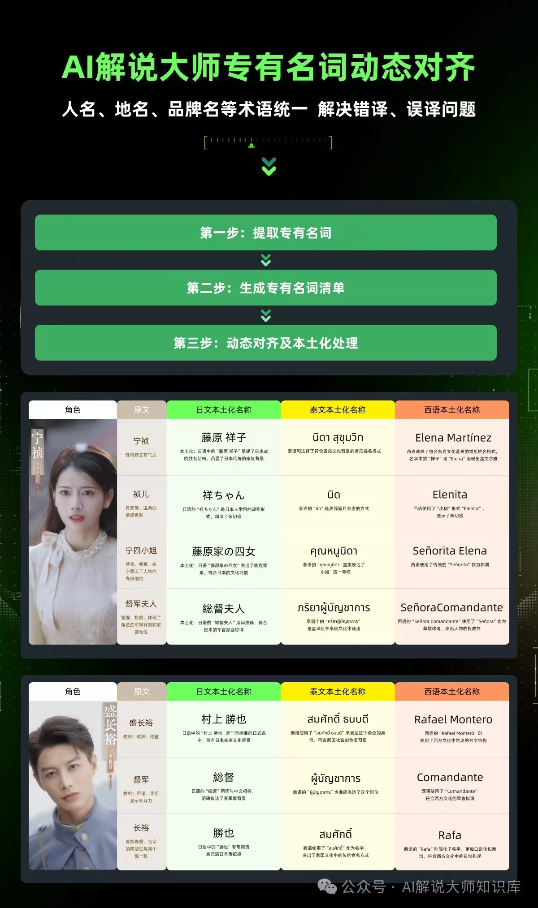
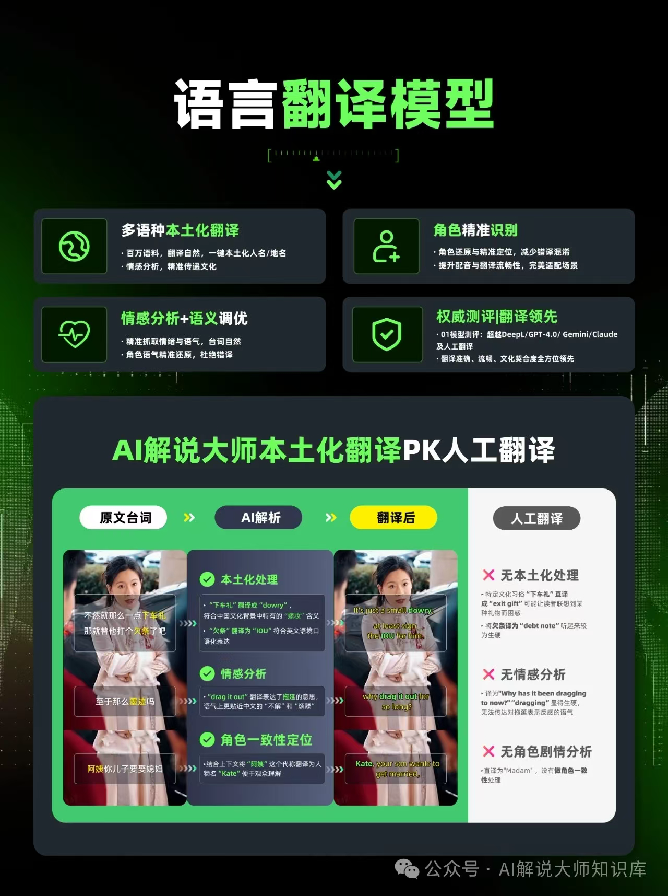

# 🎬 NarratorAI - AI-Powered Multimedia Content Processing Platform | Video AI Processing | Subtitle Extraction | Seamless Subtitle Removal

[](https://opensource.org/licenses/MIT)


[中文](README.md) | [English](README.en.md)

## 📌 Project Overview

**NarratorAI** is a powerful AI-driven multimedia processing platform designed for content creators, short video production teams, MCN organizations, and global enterprises. We provide a one-stop video processing solution, including subtitle extraction, translation, removal, embedding, and AI narration, helping you achieve rapid content globalization and localization.

> **Core Advantage:** Our industry-leading AI engine delivers unparalleled processing quality and efficiency, reducing manual costs by 90% while increasing content production speed by 10x.

**Online Access:** [https://ai.jieshuo.cn/](https://ai.jieshuo.cn/)

## 🚀 Use Cases

- **Global Video Distribution** - Quickly translate short videos into different local languages for various markets
- **Video Narration** - Automatically generate professional narration to enhance video appeal
- **Media Content Creation** - Improve content creation efficiency with automated translation and subtitle processing
- **Educational Institutions** - Localize educational video content for learners in different language regions
- **Corporate Training** - Create multilingual versions of internal training videos
- **Game Developers** - Produce multilingual versions of game promotional videos

## 💪 Our Core Capabilities

### 1️⃣ Professional Video Translation

- **Full Process Automation:** Upload a video, and the API automatically completes subtitle extraction, content translation, subtitle generation, and video composition
- **Seamless Subtitle Removal:** Intelligently identify and remove existing hard subtitles while maintaining natural video quality
- **High-Fidelity Translation:** Utilize domain-trained neural network models to ensure accuracy of technical terms and natural language flow
- **Multi-language Support:** Support for all major languages, including less common ones

### 2️⃣ AI Video Narration

- **Intelligent Content Understanding:** Deep learning-based video content analysis for accurate scene, action, and theme comprehension
- **Professional Narration Generation:** Automatically generate professional, fluent narration that matches video style and theme
- **Industry Adaptability:** Adjust narration style according to different industries and domains

### 3️⃣ Subtitle Translation

- **Efficient Processing:** Direct upload of SRT format subtitle files for quick translation results
- **Format Preservation:** Perfect retention of original subtitle timing and formatting
- **Terminology Consistency:** Support for custom glossaries to ensure accurate and uniform translation of technical terms
- **Translation Coherence:** Intelligent maintenance of contextual consistency to avoid fragmented translations

### 4️⃣ Subtitle Extraction

- **OCR Technology Extraction:** Use high-precision OCR technology to recognize and extract hard subtitles from video frames with up to 98% accuracy
- **Intelligent Processing:** Automatically process subtitles with various fonts, colors, and backgrounds
- **Timeline Preservation:** Precisely locate the appearance and disappearance time of each subtitle
- **Language Support:** Capable of recognizing Chinese and English languages

### 5️⃣ Seamless Subtitle Removal

- **Intelligent Recognition Technology:** Employ the latest AI visual recognition models to automatically locate hard subtitles in videos
- **Scene-Aware Removal:** Intelligently reconstruct areas covered by subtitles based on video background
- **Maintain Visual Consistency:** Ensure the removed areas seamlessly blend with the original background, leaving no detectable traces of modification

### 6️⃣ Video Subtitle Embedding

- **Professional Embedding Engine:** Use broadcast-grade video processing technology to perfectly combine SRT subtitle files with videos
- **Subtitle Style Customization:** Support customization of font, size, color, position, border, and various visual effects
- **Video Quality Preservation:** The embedding process maintains original video quality, supporting HD, 4K, and various resolutions
- **Batch Processing:** Capable of processing multiple subtitle embedding tasks simultaneously for improved efficiency

## 🛠️ Technical Architecture

- **Frontend Framework:** Next.js 15+ / React 19 / TypeScript
- **UI Components:** Shadcn/ui + Tailwind CSS
- **State Management:** React Hooks
- **API Communication:** Axios
- **Form Handling:** React Hook Form + Zod

## ⚡ Quick Start

### Requirements

- Node.js 18.0+
- npm 8.0+

### Getting Started

1. **Get the code:**

   ```bash
   git clone https://github.com/Narrator-AI/NarratorAI.git
   cd NarratorAI
   ```

2. **Install dependencies:**

   ```bash
   npm install
   ```

3. **Start the demo interface:**

   ```bash
   npm run dev
   ```

### Interface Workflow

1. Configure your API key in the interface after startup
2. Create a project folder or select an existing one
3. Upload video or SRT files
4. Select processing type and target language
5. Submit the task and view processing progress
6. Download or preview the processing results online

## 📈 Performance Metrics & Advantages

| Feature | Our AI API | Generic Solutions |
|---------|------------|-------------------|
| Translation Quality | Professionally trained models, industry terminology support | Generic translation, lacks specialization |
| Subtitle Recognition Accuracy | 98%+ | 80-85% (ideal conditions) |
| Processing Speed | 3-5 minutes for a 10-minute video | 10-15 minutes for a 10-minute video |
| Multi-language Support | All major languages, including less common ones | Major languages, limited support for less common ones |
| Batch Processing | Supports large-scale parallel tasks | Single task processing, weak concurrency |
| Scenario Adaptability | Optimized for short videos, novels, public account articles | Generic processing, lacks scenario optimization |

### Comparison with Traditional Video Translation Methods

| Feature | NarratorAI | Traditional Video Translation Tools |
|---------|---------------|----------------|
| Processing Speed | Fast (AI-assisted) | Slow (manual processing) |
| Multi-language Support | Extensive | Limited |
| Localization Capability | Intelligent recognition | Manual processing |
| Batch Processing | Supported | Limited or not supported |
| User Interface | Modern, intuitive | Complex, professional |
| Learning Curve | Gentle | Steep |
| Cloud Integration | Fully supported | Limited support |

## 🤔 Why Choose NarratorAI?

* **Focus on Content Intelligence** - Our team consists of content creation and AI technology experts with deep understanding of content processing needs
* **Open Ecosystem** - Frontend is completely open source, customizable, and can be integrated into existing workflows
* **Continuous Innovation** - We constantly introduce new features, maintaining technological leadership
* **Easy to Use** - No complex configuration needed, intuitive API design, quick to get started
* **Cost-effective** - Significantly reduces costs and time investment compared to expensive manual translation and processing

## 📹 Case Studies

### Integrated Subtitle Removal + Translation + Re-embedding Process

**Client Challenge:** A web drama production company had a popular 60-episode Chinese web drama with Chinese hard subtitles. They needed to create versions in English, Thai, Japanese, and Spanish to expand into overseas markets. The traditional process would require multiple professional teams working together, taking 3 months and incurring high costs.

**Integrated Solution:**
1. **Subtitle Removal:** Used NarratorAI's seamless subtitle removal API to intelligently identify and remove all original Chinese hard subtitles
2. **Subtitle Extraction & Translation:** Simultaneously used the subtitle extraction API to obtain original Chinese dialogue and the professional translation API to convert it to target languages
3. **Translation Optimization:** AI automatically adjusted cultural expressions to match target market conventions
4. **Subtitle Embedding:** Automatically embedded translated multilingual subtitles back into the subtitle-free video, maintaining professional quality

**Overall Processing Flow:**
 <div style="text-align: center;">
        
    </div>

**Processing Effect Comparison**:

<div style="display: flex; flex-direction: column; gap: 20px;">
    <div style="text-align: center;">
        <p><strong>Subtitle Extraction</strong></p>
        
    </div>
    <div style="text-align: center;">
        <p><strong>After Subtitle Removal</strong></p>
        
    </div>
    <div style="text-align: center;">
        <p><strong>Technical Term Translation Comparison</strong></p>
        
    </div>
    <div style="text-align: center;">
        <p><strong>Translation Results</strong></p>
        
    </div>
</div> 

**Project Outcomes:**

- Four language versions of 60 episodes completed within 2 days
- Processing cost reduced by 78% compared to traditional workflow
- Video quality score reached 96% of professional standards
- Translation accuracy score reached 97%
- First week overseas viewership exceeded 8.5 million

> "NarratorAI's integrated processing functionality has completely transformed our internationalization workflow. Projects that previously required multiple teams working consecutively for months now only need video upload, target language selection, and a few days later, we receive professional-quality multilingual versions. This not only saves significant costs and time but also delivers translation quality that even exceeds our professional human teams." — Manager Zhou, Web Drama International Distribution Department.

---

## 👍 User Success Stories

> "As a small to medium-sized content production company, we don't have the resources to build a large translation team. NarratorAI enables us to achieve enterprise-level content internationalization. Our YouTube international channel subscriptions tripled in just one month." — Mr. Wang, Content Creator

> "We've tried almost every automatic subtitle extraction tool on the market, but only NarratorAI could handle our special fonts and semi-transparent subtitle effects with surprising accuracy." — Ms. Chen, Video Archive Manager

> "From submitting a video to getting perfectly translated versions in 5 languages, the entire process took less than 20 minutes, which was unimaginable in the past." — Director Liu, Cross-border E-commerce Manager

> "The biggest challenge in exporting short dramas is language and cultural barriers. NarratorAI not only solved the technical translation issues but also adjusted cultural expressions for different markets, helping our short dramas achieve viewership beyond expectations overseas." — Producer Sun, Short Drama Producer

## 📅 Development Roadmap

**Feature Implementation Plan:**

* [x] Video translation interface
* [x] SRT subtitle translation functionality
* [ ] Subtitle extraction frontend interface
* [ ] Subtitle removal frontend interface
* [ ] Video embedding frontend interface
* [ ] AI narration interactive interface

## 📮 Contact Us

Contact us on WeChat for API licensing, business cooperation, product trials, and technical support.

- **WeChat ID:** gezimufeng

<div align="center">
  
</div>

## 🔐 License

* **Frontend Code:** Released under [MIT License](https://opensource.org/licenses/MIT)
* **API Service:** Commercial license required, please contact us for details

<div align="center">
  <p>Developed by NarratorAI Team | Contributions and Feedback Welcome</p>
</div>
